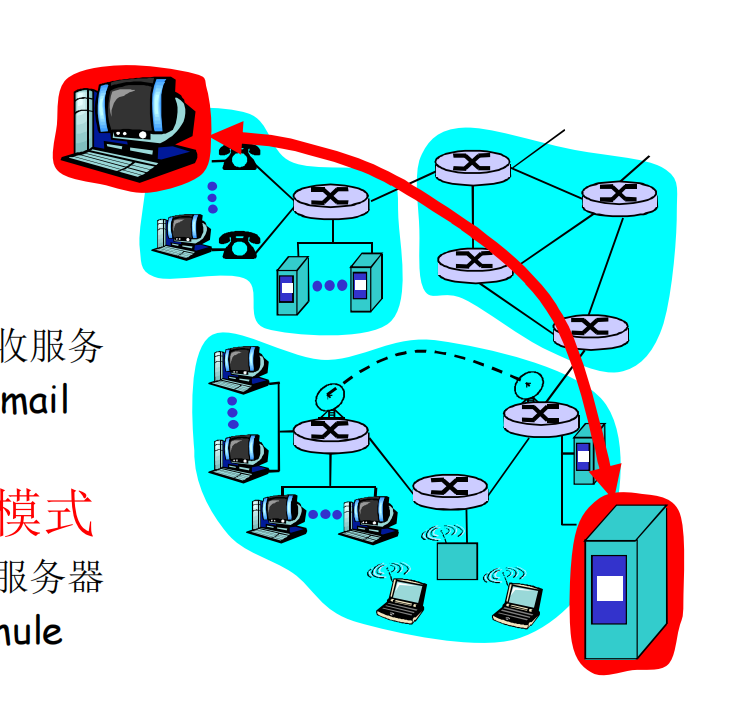
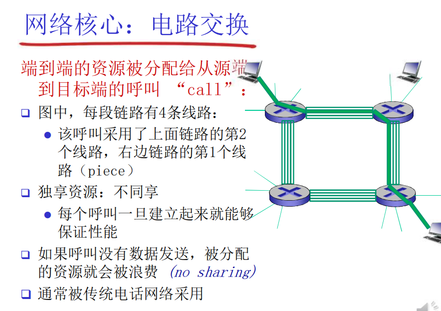
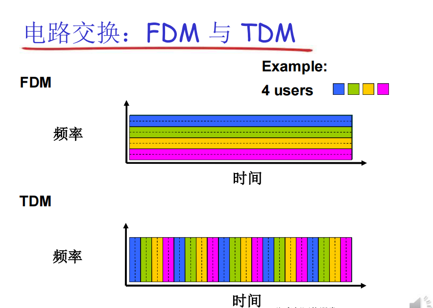
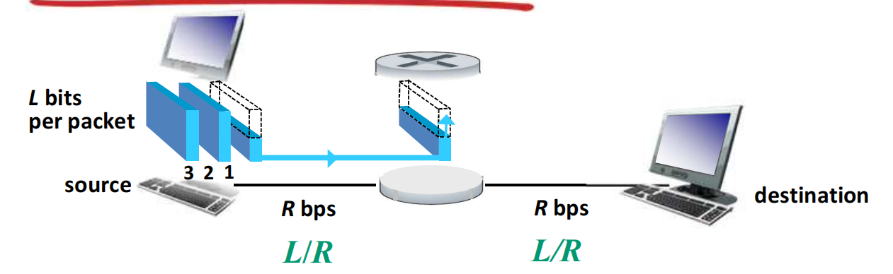
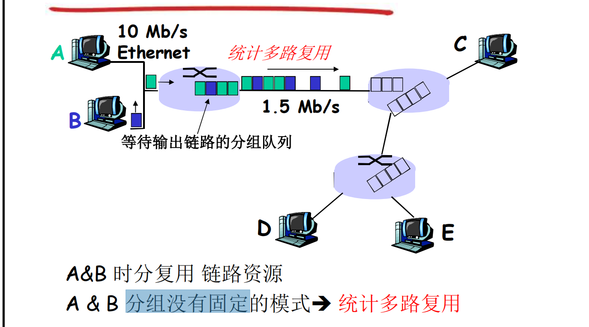
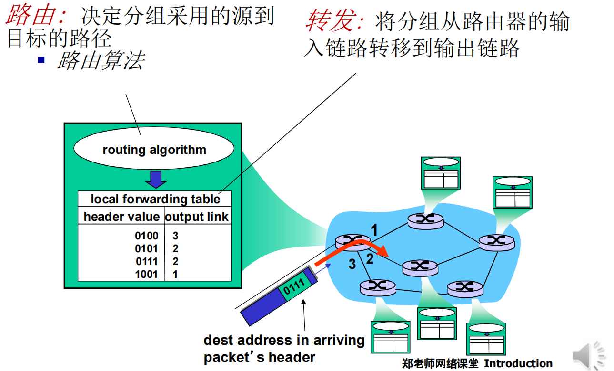
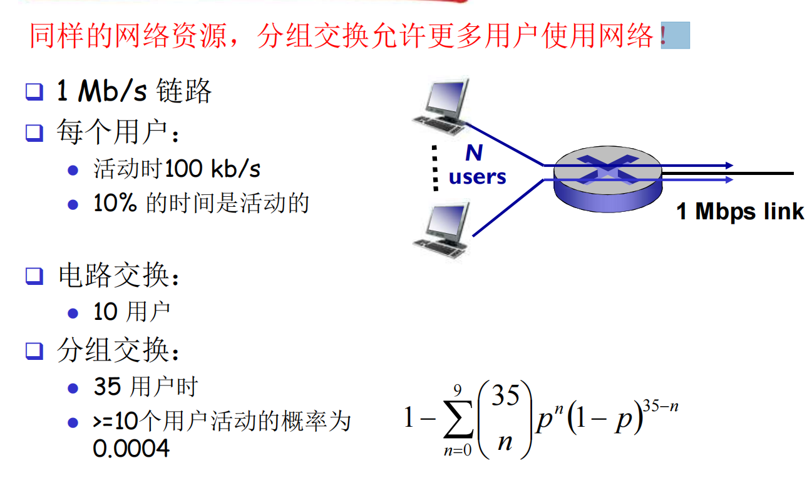
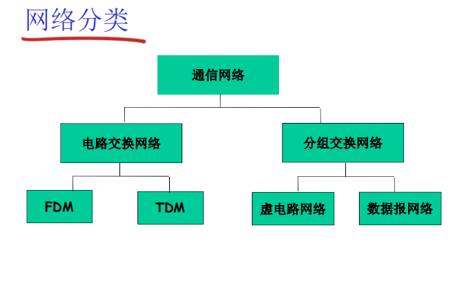

# 什么是Internet

#### 从具体构成角度描述

节点

- 主机及其上运行的应用程序
- 路由器、交换机等网络交换设备

边 ： 通信链路 (communication link)

- 接入网链路 ： 主机连接到互联网的链路
- 主干链路： 路由器间的链路

数以亿计的、互联网的计算设备：

- **主机（host） = 端系统 (end system)**
- 运行 **网络应用程序**

通信链路：

- 光纤、同轴电缆、无线电、卫星
- 传输速率 = **带宽 （bps)**

分组交换设备 ： 转发分组（packets）

- 路由器和交换机

**协议**控制发送、接收消息

- 如 TCP、IP、HTTP、FTP、PPP

**Internet ： “网络的网络”**

- 松散的层次结构，互连的 ISP
- 公共 Internet vs. 专用 intranet

Internet 标准

- RFC ： Request for comments
- IETF ： Internet Engineering Task Force

#### 从服务角度描述

使用通信设施进行通信的**分布式应用**

- Web、VoIP、email、分布式游戏、电子商务、社交游戏…
- …

**通信基础设施为 apps 提供编程接口（通信服务）**

- 将发送和接收数据的app与互联网连接起来
- 为APP 应用提供服务选择，类似于邮政服务
  - 无连接不可靠服务
  - 面向连接的可靠服务

#### 网络协议

-----------------

- 类似人类协议
- 机器之间的协议而非人与人之间的协议
- Internet 中所有的通信行为都受协议制约

> 协议（**protocol**）定义了在两个或多个通信实体之间交换的 **报文格式** 和 **次序**，以及 在 报文传输和 / 或接收 或 其他事件方面所采取的 **动作**

# 网络结构

- 网络边缘：
  - 主机(端系统)
  - 应用程序（客户端和服务端）
- 网络核心
  - 互连着的路由器
  - 网络的网络 以 中国科学技术大学 郑烇老师的计算机网络为主线，<计算机网络-自顶向下方法>第7版、自己查阅资料辅助总结的学习笔记。内容包括 计算机网络概述、应用层、运输层、网络层、数据链路层、物理层等知识。
- 接入网、物理媒体
  - 有线或者无线通信链路

# 网络边缘

- 端系统（主机）
  - 运行 应用程序
  - 如 web、email
  - 在 “ 网络的边缘”
- 客户/服务器模式
  - 客户端向服务器端请求/接收服务
  - 如 web 浏览器/服务器 ： email 客户端/服务器
- 对等（peer-peer） 模式
  - 很少（甚至没有）专门的服务器
  - 如 GnutElla、KaZaA、Emule

#### 采用 网络设施的面向连接服务

**目标** ： 在 端系统之间传输数据

##### 握手：

在数据传输之前做好准备

- 人类协议中 ： 你好、你好
- 两个通信主机之间为 **连接建立状态**

##### TCP - 传输控制协议（Transmission Control Protocol）

Internet 上面向连接的服务

- 可靠地、按顺序地传送数据
  - 确认和重传
- 流量控制
  - 发送方 不会淹没接收方
- 拥塞控制
  - 当网络拥塞时，发送方降低发送速率

#### 采用基础设施的无连接服务

**目标**：在端系统之间传输数据

**UDP** - 用户数据报协议 （User Datagram Protocol )

- 无连接
- 不可靠数据传输
- 无流量控制
- 无拥塞控制

#### 使用 TCP 的应用

- HTTP（web）
- FTP（文件传送）
- Telnet（远程登录）
- SMTP（email）

#### 使用 UDP 的应用

- 流媒体
- 远程会议
- DNS
- Internet 电话

# 网络核心

网络核心： 路由器的网状网络（即由互联因特网端系统的分组交换机和链路构成的网状网络）

## 基本问题：数据怎样通过网络进行传输？

- **电路交换**：为每个呼叫预留一条专有电路：如 电话网
- **分组交换**：
  - 将要传送的数据分成一个个单位： 分组
  - 将分组从一个路由器传到相邻路由器（hop ），一段段最终从源端传到 目标端
  - 每段 ： 采用链路的 **最大传输能力**（带宽）

## 电路交换

在电路交换网络中，在端系统间通信会话期间，预留了端系统间沿路径通所需要的资源（缓存、链路传输速率）

**端到端的资源被分配给从源端到目标端的呼叫 “ call ”**

##### **网络资源（如带宽）被分成 片**

- 为呼叫分配片
- 如果某个资源处于**空闲状态**（不共享）
- 将 带宽分成片
  - 频分（Frequency - division multiplexing）
  - 时分（Time - division multiplexing）
  - 波分（Wave - division multiplexing）

##### 电路交换不适合计算机之间的通信的原因

- 连接建立时间长
- 计算机之间的通信有突发性，如果使用线路交换，则浪费的片比较多
  - 即使 这个呼叫没有数据传输，其所占据的片也不能够被别的呼叫使用
- 可靠性不高 **？**

## packer switching 

**以分组为单位存储-转发方式**

- 网络带宽资源不再分为一个一个片，传输时使用全部带宽
- 主机之间传输的数据 被划分为一个个分组

- store-and-forward packet switching  分组每次移动一跳（ hop ）
  - 在转发之前，节点必须收到整个分组
  - 延迟比线路交换要大
  - 排队时间

在一个速率为R bps的链路，一个长度为L bits 的分组的存储转发延时： L/R s
sending one packet from source to des-tination overa path consisting of N links each of rate R:        d =  N * L/R
sending p packets from source to des-tination overa path consisting of N links each of rate R:     
d = P (L/R）+ (N-1） (L/R）

**queuing delay and packet loss**

- 如果到达速率>链路的输出速率:
  - 分组将会排队，等待传输
  - 如果路由器的缓存用完了，分组将会被抛弃

### 统计多路复用

分组交换网络中的多路复用技术是“统计多路复用”，又叫做异步时分多路复用，**它和时分多路复用类似，不同的信道是按时间片分配的，但统计多路复用的最大不同点是:它的时间片是动态分配大小的，而不是固定相等的长度**，所以统计多路复用是一种**根据用户实际需要动态分配线路资源的时分复用方法。**

## 网络核心的关键功能

(后续章节有详细内容)

路由  : 决定分组采用的源到目标的路径     **路由算法**

转发  :  将分组从路由器的输入链路转移到输出链路

## 分组交换 vs. 电路交换

- 分组交换适合于对突发式数据传输
  - 资源共享
  - 简单，不必建立呼叫

- 过度使用会造成网络拥塞：分组延时和丢失

  - 对可靠地数据传输需要协议来约束：拥塞控制

- Q: 怎样提供类似电路交换的服务？

  - ​	保证音频/视频应用需要的带宽 
  - 一个仍未解决的问题(chapter 7)

  

 分组交换: 分组的存储转发一段一段从源端传到目标端，按照有无网络层的连接，分成：
 数据报网络：
	分组的目标地址决定下一跳
	在不同的阶段，路由可以改变
	类似：问路
	Internent
 虚电路网络：
	每个分组都带标签（虚电路标识 VC ID），标签决定下一跳
	在呼叫建立时决定路径，在整个呼叫中路径保持不变
	路由器维持每个呼叫的状态信息
	X.25 和ATM

# Delay, Loss, and Throughputin Packet-Switched Networks

As a packet travels from onenode (host or router) to the subsequent node (host or router) along this path, the packet suffers from several types of delays at each node along the path. The most
important of these delays are the nodal processing delay(节点处理延迟), queuing delay(排队时延), transmision delay(传输时延), and propagation delay(传播时延)
All of these delays are fixed, except for the queuingdelays, which are variable.

传输时延 : L / R
传播时延 : D / S

排队时延和丢包
	流量强度

​	

# 协议层次

应用层：报文(message)

传输层：报文段(segment)：TCP段，UDP数据报

网络层：分组packet（如果无连接方式：数据报datagram）

数据链路层：帧(frame)

物理层：位(bit)

