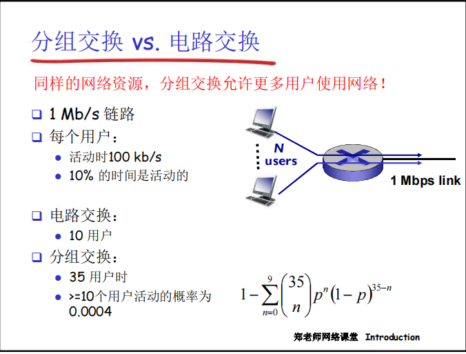
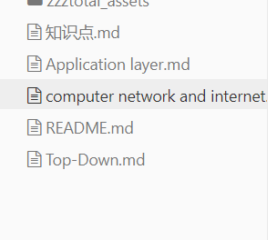
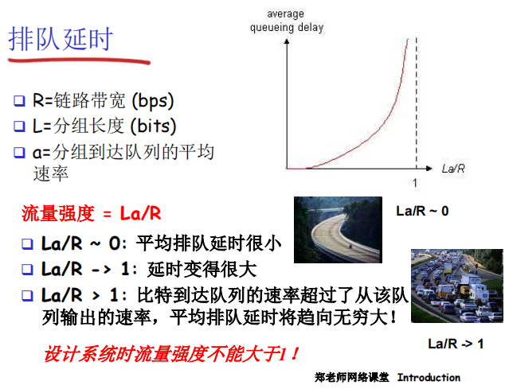
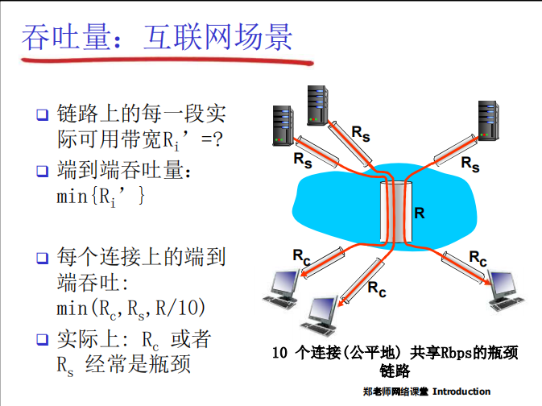
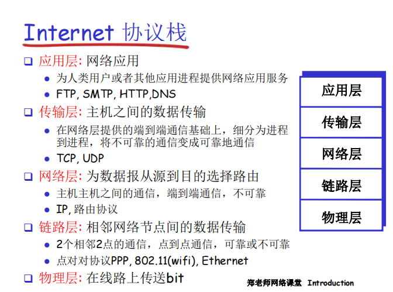
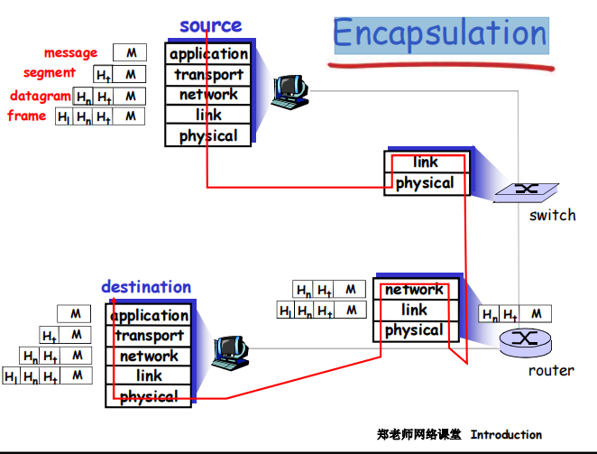

# packer switching

store-and-forward packet switching
	在转发之前，节点必须收到整个分组
		有利于共享网络
	分组每次移动一跳（ hop ）
	主机之间传输的数据被分为一个个分组
	网络带宽资源不再分分为一个个片，传输时使用全部带宽
	在一个速率为R bps的链路，一个长度为L bits 的分组的存储转发延时： L/R s
		sending one packet from source to des-tination overa path consisting of N links each of rate R:        d =  N * L/R
		sending p packets from source to des-tination overa path consisting of N links each of rate R:     
		d = P (L/R）+ (N-1） (L/R）

queuing delay and packet loss
	如果到达速率>链路的输出速率:
		分组将会排队，等待传输
		如果路由器的缓存用完了，分组将会被抛弃

Forwarding Tables and Routing Protocols

分组交换网络中的多路复用技术是“统计多路复用”，又叫做异步时分多路复用，**它和时分多路复用类似，不同的信道是按时间片分配的，但统计多路复用的最大不同点是:它的时间片是动态分配大小的，而不是固定相等的长度**，所以统计多路复用是一种**根据用户实际需要动态分配线路资源的时分复用方法。**

分组交换适合于对突发式数据传输

 资源共享

 简单，不必建立呼叫

 过度使用会造成网络拥塞：分组延时和丢失

 对可靠地数据传输需要协议来约束：拥塞控制

 Q: 怎样提供类似电路交换的服务？
	保证音频/视频应用需要的带宽
	一个仍未解决的问题(chapter 7)

 分组交换: 分组的存储转发一段一段从源端传到目标端，按照有无网络层的连接，分成：
 数据报网络：
	分组的目标地址决定下一跳
	在不同的阶段，路由可以改变
	类似：问路
	Internent
 虚电路网络：
	每个分组都带标签（虚电路标识 VC ID），标签决定下一跳
	在呼叫建立时决定路径，在整个呼叫中路径保持不变
	路由器维持每个呼叫的状态信息
	X.25 和ATM

![[zzztotal_assets/Pasted image 20230428103510.png]]

# Delay, Loss, and Throughputin Packet-Switched Networks

As a packet travels from onenode (host or router) to the subsequent node (host or router) along this path, the packet suffers from several types of delays at each node along the path. The most
important of these delays are the nodal processing delay(节点处理延迟), queuing delay(排队时延), transmision delay(传输时延), and propagation delay(传播时延)
All of these delays are fixed, except for the queuingdelays, which are variable.

传输时延 : L / R
传播时延 : D / S

排队时延和丢包
	流量强度

​	

# 协议层次

应用层：报文(message)

传输层：报文段(segment)：TCP段，UDP数据报

网络层：分组packet（如果无连接方式：数据报datagram）

数据链路层：帧(frame)

物理层：位(bit)

